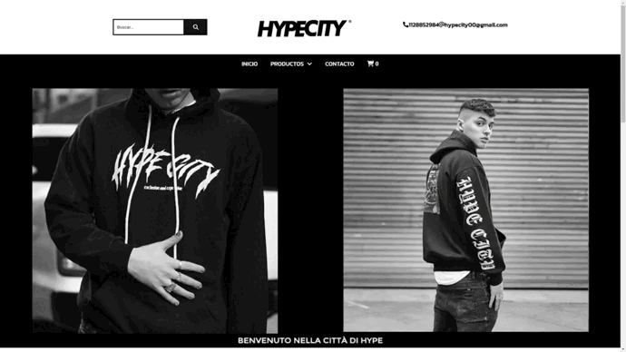

# Proyecto Final CoderHouse

## Hypecity
En este proyecto se llevó a cabo hacer un **E-commerce**, en el cual me base en una marca de ropa Argentina que me gusta mucho. 
Este trabajo está principalmente hecho por el framework de React, de JavaScript pero no fue lo único que se utilizó, sino que también se usaron otras tecnologías o librerias tales como:

- **React(principal)**
- **Fireabse**
- **Router**
- **Bootstrap**
- **Sweet Alert**
- **Emailjs**

## Funcionamiento del E-commerce
